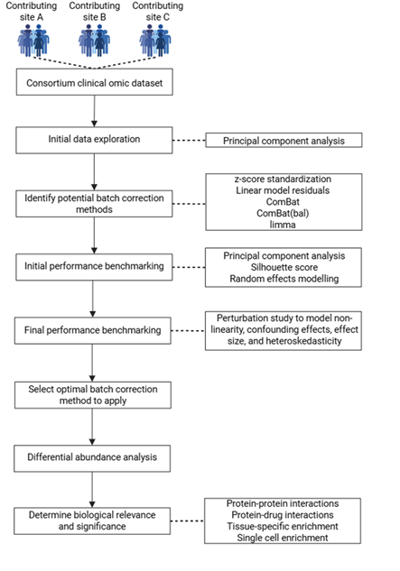

### _Mapping the circulating proteome across neurodegeneration: A harmonized, consortium-scale framework for uncovering molecular pathophysiology_
This repository contains source code for the paper titled **_Mapping the circulating proteome across neurodegeneration: A harmonized, consortium-scale framework for uncovering molecular pathophysiology_** (bioRxiv; https://www.biorxiv.org/content/10.64898/2025.12.09.693329v1.abstract). The aim of the study was to develop and benchmark a scalable harmonization framework for multi-site plasma proteomics and use it to identify reproducible, disease-resolved circulating protein signatures (shared and disease-specific) across major neurodegenerative disorders to inform biomarker and therapeutic target discovery.
#### SNAPSHOT OF THE RESEARCH
**Data and Participants:** We analysed the Global Neurodegeneration Proteomics Consortium (GNPC) plasma proteomics dataset (v1), which includes 13,733 participants contributed by 16 international sites and spans five neurodegenerative disorders plus non-impaired controls: non-impaired controls (n = 8,372), Alzheimer’s disease (AD; n = 4,217), frontotemporal dementia (FTD; n = 175), Parkinson’s disease dementia (PDD; n = 185), Parkinson’s disease (PD; n = 540), and amyotrophic lateral sclerosis (ALS; n = 244). Plasma proteomics was generated using the SomaScan 7k assay. The resulting analysis matrix contained 6,340 unique plasma protein measurements per participant, provided as normalized, calibrated relative fluorescence units (RFU).

**Methods:** We first performed global quality control and exploratory analyses to characterise technical structure, then systematically benchmarked multiple batch correction strategies using complementary criteria (multivariate separation metrics and variance-partitioning of residual site versus disease signal), including stress-testing via perturbation/signal injection simulations under varying effect sizes, sparsity, and site-outcome confounding. Using the selected harmonisation approach, we identified disease-control protein differences with moderated linear modelling and site-aware meta-analytic aggregation and applied explicit cross-site robustness filters (e.g. site dominance, directional discordance, and leave-one-site-out fragility) to prioritise reproducible signals. Finally, we interpreted robust proteins using functional enrichment and network/tissue-context analyses to nominate biological pathways and candidate therapeutic targets (Fig. 1).

_**Figure 1.**_ _Methodological pipeline of the current study and for analyzing consortium-generated clinical omic datasets. Clinical omic data is collected from across various contributing clinical sites. Data is then initially explored using a principal component analysis (PCA). Potential batch correction methods are identified and their performance benchmarked using methods including PCA, silhouette score, and random effects modelling. The performance of batch correction methods is then benchmarked via a perturbation study to model non-linearity, confounding effects, effect size, and heteroskedasticity. Based on these benchmarking metrics, an optimal batch correction method is selected, and differential abundance analysis is done to identify molecular candidates. The biological relevance and significance of the identified molecular candidates is assessed using methods including protein-protein interactions, protein-drug interactions, and tissue-specific and single cell enrichments._

**Results:** Site/batch effects dominated the uncorrected proteome (e.g. in AD, site explained ~7.9% of variance vs <1% for diagnosis), and benchmarking showed that model-based harmonisation, most consistently limma, best removed site structure while preserving biological signal (Fig. 2). After harmonisation and site-aware differential analysis, we recovered cross-site-reproducible disease signatures (AD: 2,524; PD: 580; FTD: 101; ALS: 85; PDD: 64 proteins), highlighting a shared immune-metabolic stress axis (strongest in AD/PD) alongside disease-specific biology (AD broad systemic remodelling; ALS enriched for neuromuscular/contractile proteins). In conservative age/sex-matched prioritisation, AD retained a robust disease-specific core (11/15 top proteins unique), ALS showed the strongest specificity (10/15 unique), PD retained only SUMF1 and TPPP3, FTD retained HS6ST3, and no PDD markers survived matching, yielding a focused shortlist for downstream validation.

_**Figure 2.**_ _Batch effects are present in the raw plasma proteomic data after integrating across multiple sites and these are differentially affected by batch correction methods. (a) Principal component analysis (PCA) of 6,340 plasma proteins measured in patients with AD and NI controls showing no disease-specific group clustering. (b) PCA of 6,340 plasma proteins measured in all individuals from across 16 contributing sites similarly revealing no site-specific clustering of cases. (c) Random effects modelling showing 7.9% of the per-protein variance is attributable to site in the plasma proteomic dataset. (d) Random effects modelling showing that less than 1% of the per-protein variance is attributable to outcome (diagnosis) in the plasma proteomic dataset. (e) Variance explained by principal component (PC) 1 and PC2 in the raw plasma proteomic dataset and following batch correction using z-score, linear model (LM) residuals, ComBat, ComBat(bal), and limma. All methods reduced PC1 variance to 15-16% whereas PC2 variance was maintained at around 4%. (f) Silhouette score using site labels across the top 10 PCs showing reduced site-based clustering across batch correction methods. (g) Random effects modelling showing that all five batch correction methods eliminate site-related variance. ComBat, ComBat(bal), and limma also show minimal residual tails, suggesting fewer proteins remain influenced by site after correction. (h) Random effects modelling showed that LM residuals and z-score suppressed outcome-related (biological) signal to a greater degree than ComBat, ComBat(bal), and limma. (i) Proportion of outcome variance retained by the correction methods showing limma retains the greatest proportion. (j) Outcome-related variance across the perturbation study showing that limma consistently preserves the highest level of outcome-related variance under different analytical conditions. (k) Site-related variance across the perturbation study showing that all batch correction methods effectively remove site-related variance across different conditions._

**Conclusion:** Together, these results show that rigorous, quantitative harmonisation is essential for consortium-scale plasma proteomics and can unlock reproducible, cross-site disease signals that are otherwise masked by technical variation. Our framework provides a practical blueprint for benchmarking batch correction, filtering for robustness across sites, and prioritising disease-linked proteins and pathways, yielding a concise cross-disease candidate list suitable for independent validation and translational follow-up.